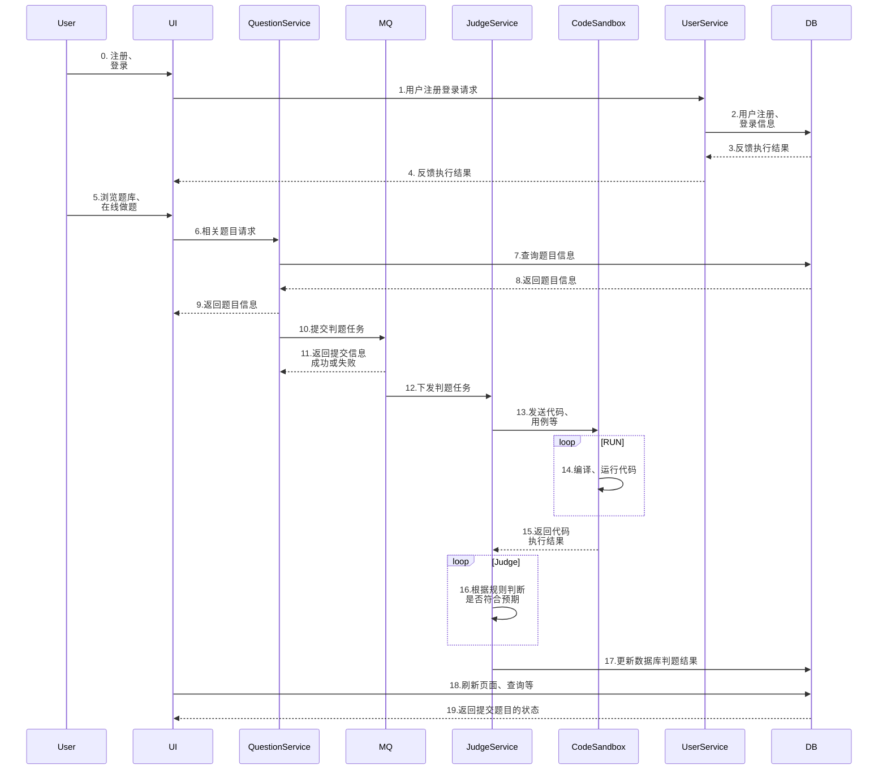
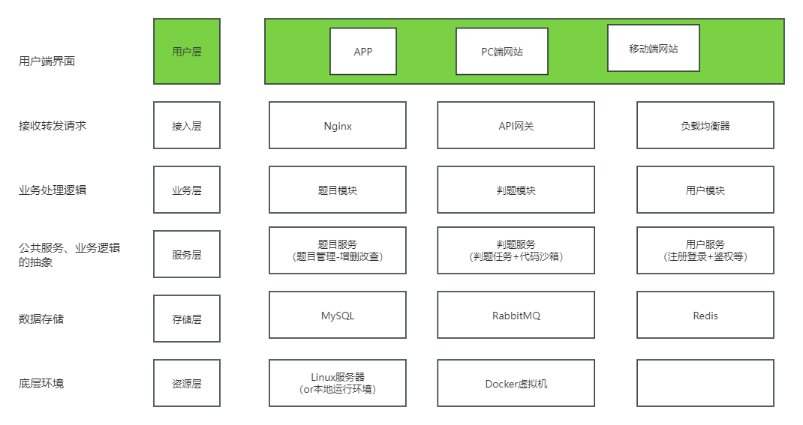
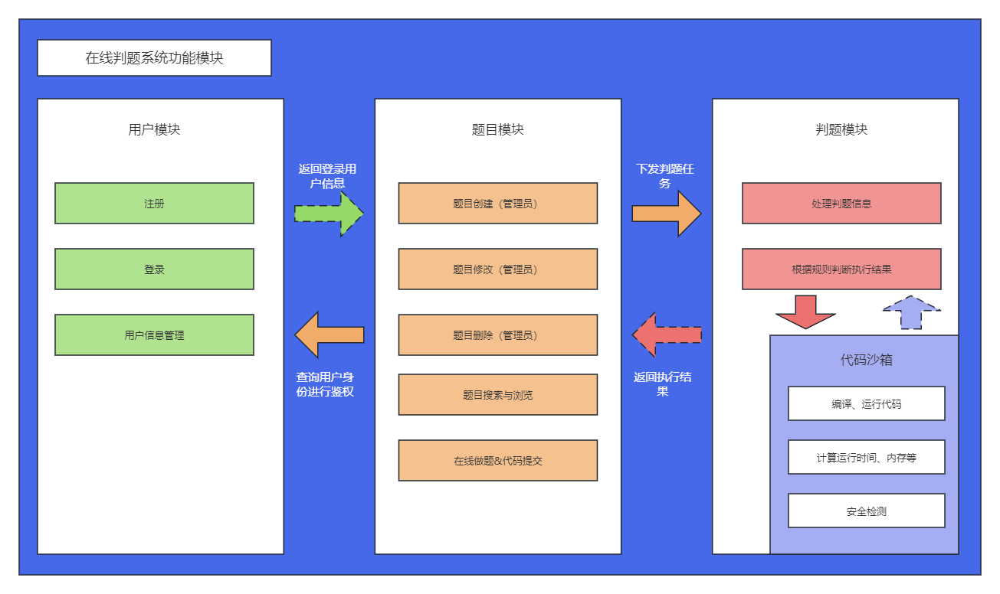
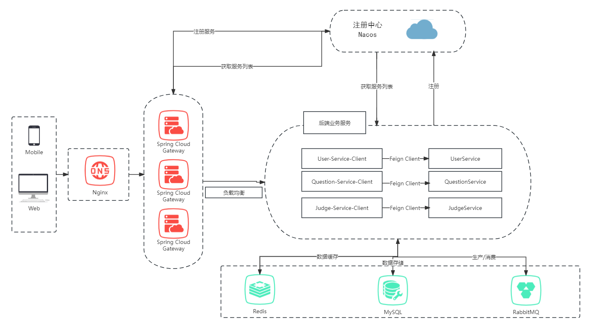
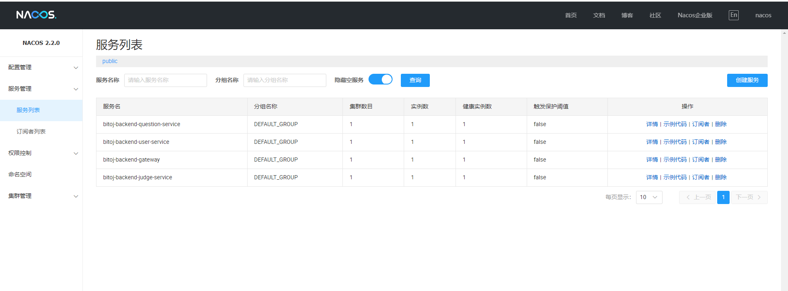
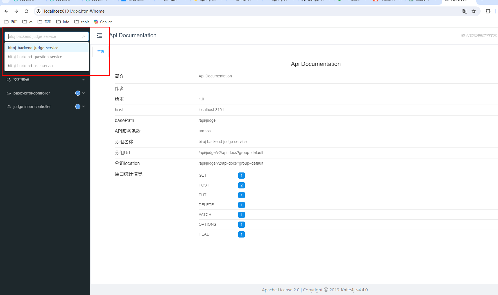

<div  style="display: flex; justify-content: center;">
     
     
     
     
</div>
<div  style="display: flex; justify-content: center;">
     
     
     
     
</div>

<div  style="display: flex; justify-content: center;">
     
     
     
     
     
     


​    

<h1 align="center">
    <p>
        <strong>一个还没有名字的在线判题系统</strong> 
    </p> 
    <p style="font-size: 10px; margin-top: 10px;">
        Author：<a href="https://github.com/LiangshouX" target="_blank">LiangshouX</a>
    </p>
</h1>
> * 项目来源：https://yupi.icu
> * 加入链接：https://t.zsxq.com/187srd088

一个基于 Spring Boot + Spring Cloud 微服务架构和 Vue 3 + Arco Design 的编程题目在线评测系统。系统前台提供管理员创建和管理题目的功能，用户可以搜索、阅读题目，并编写并提交代码。系统后端根据管理员设定的题目测试用例，在自主实现的代码沙箱中对代码进行编译、运行，并判断输出是否正确。

代码沙箱可以作为独立服务，提供给其他开发者使用。


# Quick Start

如果您想在本地运行本项目，首先请确保以下环境已经准备就绪：

> * Java
> * mysql
> * RabbitMQ
> * Nacos(微服务后端)
> * Redis
> * NodeJs


### 拉取项目到本地

使用克隆命令：

```shell
git clone git@github.com:LiangshouX/bitoj.git
or
git clone https://github.com/LiangshouX/bitoj.git
```

或直接下载压缩包。


### 启动后端项目

后端项目有两种启动方式，您可以选择启动后端微服务 `bitoj-backend-microservice`，或者启动后端单体项目 `bitoj-backend`。

> :warning: 两种启动方式均需要启动代码沙箱 `bitoj-backend-microservice/bitoj-code-sandbox` 

#### 方式一：启动后端单体项目

1. 刷新 Maven 配置，等待依赖安装

2. 修改 `application.yml` 中的相关配置：

   ```yml
   spring:
     datasource:
       driver-class-name: com.mysql.cj.jdbc.Driver
       url: jdbc:mysql://localhost:3306/bit_oj
       username: XXX # 修改为您的数据库用户名
       password: XXX # 对应的密码
     # Redis 配置
     # todo 需替换配置，然后取消注释
     # redis:
     #  database: 1
     #  host: localhost
     #  port: 6379
     #  timeout: 5000
   ```

   > :warning: 如需使用 Redis 分布式服务，需注意检查、移除 `MainApplication` 启动类开头 `@SpringBootApplication` 注解内的 exclude 参数。如：
   >
   > 修改前：
   >
   > ```java
   > @SpringBootApplication(exclude = {RedisAutoConfiguration.class})
   > ```
   >
   > 修改后：
   >
   > ```java
   > @SpringBootApplication
   > ```

   

3. 执行 `sql/sql/create_table.sql` 中的数据库语句，自动创建库表 

4. 启动项目，访问 `http://localhost:8101/api/doc.html` 即可打开后端接口文档

5. 启动代码沙箱，开启远程判题功能


#### 方式二：启动后端微服务项目

1. 启动 Nacos 服务

   > 进入 Nacos 安装路径的 `bin` 目录下，执行以下命令启动 Nacos （针对 Windows系统）：
   >
   > ```shell
   > .\startup.cmd -m standalone
   > ```

   

2. 刷新 Maven 配置，并等待依赖安装

3. 同**方式一**修改配置、连接数据库并建表等

4. 依次启动以下5项服务：

   1. `BitojBackendGatewayApplication`
   2. `BitojBackendUserServiceApplication`
   3. `BitojBackendQuestionServiceApplication`
   4. ``BitojBackendJudgeServiceApplication``
   5. `BitojCodeSandboxApplication`


### 启动前端项目

运行前端项目需要安装 vue 框架，如未安装，请参考本项目 `./docs/开发日志-01-概述 & 前端项目初始化.md` 有关前端初始化-环境配置部分的内容。

使用 WebStorm 或 VSCode 打开项目后，先执行以下命令安装所需依赖：

```shell
yarn install
or
npm i
```

依赖安装完成后执行如下命令启动项目：

```shell
yarn serve
or
npm run serve
```


# 项目业务架构与模块设计

### 核心业务流程




### 分层架构设计



### 功能模块设计




# 微服务设计

### 本项目微服务架构





### 微服务简述


微服务架构是一种软件设计模式，旨在将单个应用程序拆分为一组小型、相互独立的服务，每个服务都围绕着特定的业务功能进行构建。与传统的单体应用程序相比，微服务架构更具灵活性和可扩展性。

在微服务架构中，每个服务都有自己的数据库，并且可以使用不同的编程语言和技术栈进行开发。这使得团队可以根据需要独立开发、测试、部署和扩展每个服务，而无需影响整个应用程序。

微服务架构的另一个关键特性是服务之间的松耦合。每个服务都通过API接口与其他服务通信，这意味着可以轻松地更改、替换或升级单个服务，而不会影响整个应用程序的其他部分。

实现微服务的技术本质上都是通过HTTP，或者其他的网络协议进行通讯实现的。本项目的微服务实现主要采用 **Spring Cloud Alibaba** 技术实现，其本质是在 Spring Cloud 的基础上，进行了增强，补充了一些额外的能力，根据阿里多年的业务沉淀做了一些定制化的开发。

> * :warning: :warning: :warning: 本项目采用的 Spring Boot 版本为 2.6.13，Spring Cloud Alibaba 的对应版本请务必选择 2021.0.5，具体参考 [版本依赖关系](https://sca.aliyun.com/zh-cn/docs/2021.0.5.0/overview/version-explain/) 。
> * 关于 Spring Cloud Alibaba 技术的使用请参考官方文档：https://sca.aliyun.com/zh-cn/


### 项目微服务升级

本项目开发属于将 Spring Boot 单体应用升级为 Spring Cloud 微服务。

> 实践细节可参考官方文档：https://sca.aliyun.com/zh-cn/docs/2021.0.5.0/best-practice/spring-boot-to-spring-cloud


#### 微服务功能划分

##### 依赖服务
* 注册中心:Nacos
* 微服务网关(bitoj-backend-gateway): Gateway 聚合所有的接口，统一接受处理前端的请求

##### 公共模块

* common 公共模块(bitoj-backend-common): 全局异常处理器、请求响应封装类、公用的工具类等
* model 模型模块(bitoj-backend-model): 很多服务公用的实体类
* 公用接口模块(bitoj-backend-service-client): 只存放接口，不存放实现(多个服务之间要共享)

##### 业务功能

1. 用户服务(bitoj-backend-user-service:8102 端囗)
   1. 注册
   2. 登录
   3. 用户管理
      
2. 题目服务(bitoj-backend-question-service:8103)
   1. 创建题目(管理员)
   2. 删除题目(管理员)
   3. 修改题目(管理员)
   4. 搜索题目(用户)
   5. 在线做题(题目详情页)
   6. 题目提交
3. 判题服务(bitoj-backend-judge-service，8104 端口，较重的操作)
   1. 执行判题逻辑
   2. 错误处理(内存溢出、安全性、超时)

#### 路由划分

用 springboot 的 context-path 统一修改各项目的接口前缀，比如:

1. 用户服务:
   ./api/user
   ·/api/user/inner(内部调用，网关层面要做限制)
2. 题目服务
   ·/api/question(也包括题目提交信息)
   ·/api/question/inner(内部调用，网关层面要做限制)
3. 判题服务:
   ./api/judge
   ·/api/judge/inner(内部调用，网关层面要做限制)


#### 服务内部调用


#### 服务注册与发现——Nacos

> From： https://sca.aliyun.com/zh-cn/docs/2021.0.5.0/user-guide/nacos/overview/

微服务与传统单体式应用架构最大区别就是**强调软件模块的拆分**。在单体架构下，一个应用系统的多个功能模块由于组织在一起在同一个应用进程内部署与运行，因此，模块之间直接通过方法调用即可完成对一次请求的响应。但在微服务系统中，需要对一个应用系统根据其功能特点，按照一定粒度进行拆分后单独部署，以便实现模块内的高内聚，模块间的低耦合，实现整个微服务系统的高可扩展性。

原来一次在一个应用内即可完成的请求处理，会出现跨进程跨主机的服务调用，如何让这个服务之间能互相发现像单体式应用一样提供统一对外的服务调用能力是微服务框架层面需要重点解决的核心问题之一。 在 Spring Cloud 生态中，采用了如下服务注册与发现模型，来实现微服务之间的互相发现与调用。


如上图所示，通过在微服务系统中引入一个叫做**注册中心**的组件，来作为协调者。其最简化的过程是，所有的微服务应用在启动过程中会将自身包含服务名称、主机 IP 地址和端口号等信息发送到注册中心中，然后上游的微服务在处理请求过程中，根据服务名称到注册中心中查找对应服务的所有实例 IP 地址和端口号来进行服务调用，整个过程如图中虚线所示。从而让分散的微服务系统之间能像一个整体一样对外提供请求处理能力。


Nacos控制面板：




#### 微服务网关

微服务网关用于聚合所有接口，统一接受处理前端的请求。微服务系统中所有的服务是分散的，可能需要进行集中的管理、操作，例如集中解决跨域、鉴权、接口文档、服务的路由、接口安全性、流量染色、限流等。

##### 统一配置接口路由


```yml
spring:
  cloud:
    nacos:
      discovery:
        server-addr: 127.0.0.1:8848
    gateway:
      routes:
        - id: bitoj-backend-user-service
          uri: lb://bitoj-backend-user-service
          predicates:
            - Path=/api/user/**
        - id: bitoj-backend-question-service
          uri: lb://bitoj-backend-question-service
          predicates:
            - Path=/api/question/**
        - id: bitoj-backend-judge-service
          uri: lb://bitoj-backend-judge-service
          predicates:
            - Path=/api/judge/**
  application:
    name: bitoj-backend-gateway
```

##### 聚合所有文档

项目文档使用 Knife4j 接口文档生成器，便于以一个全局的视角集中查看、管理接口文档。

> 请参考官方文档：https://doc.xiaominfo.com/docs/middleware-sources/spring-cloud-gateway/spring-gateway-introduction


配置完成后，在网关接口中即可查看所有服务的接口文档：




##### 分布式 session 登录

:warning: 必须引入 Spring Data Redis 依赖：

```xml
        <!-- redis -->
        <dependency>
            <groupId>org.springframework.boot</groupId>
            <artifactId>spring-boot-starter-data-redis</artifactId>
        </dependency>
        <dependency>
            <groupId>org.springframework.session</groupId>
            <artifactId>spring-session-data-redis</artifactId>
        </dependency>
```

注意 Cookie 跨路径问题：

```yml
server:
  address: 0.0.0.0
  port: 8104
  servlet:
    context-path: /api/judge
    # cookie 30 天过期
    session:
      cookie:
        max-age: 2592000
        path: /api
```


##### 网关业务—跨域与权限校验

微服务网关层面定义全局跨域配置与`Filter`请求拦截器。具体实现参见相关代码。

> 扩展：可在网关实现中实现 Sentinel 接口限流降级，参考：  https://sca.aliyun.com/zh-cn/docs/2021.0.5.0/user-guide/sentinel/overview/


#### 消息队列解耦

此处选用 RabbitMQ 消息队列改造项目，解耦**判题服务**和**题目服务**，题目服务只需要向消息队列发消息，判题服务从消息队列中取消息去执行判题，然后异步更新数据库即可

> 教程参考：https://www.rabbitmq.com/tutorials/tutorial-one-java


# 部署上线


### Docker简述

Docker 由镜像(Image)、容器(Container)、仓库(Repository) 三部分组成。

Docker 的镜像可以简单的类比为电脑装系统用的系统盘，包括操作系统，以及必要的软件。例如，一个镜像可以包含一个完整的 centos 操作系统环境，并安装了 Nginx 和 Tomcat 服务器。注意的是，镜像是只读的。这一点也很好理解，就像我们刻录的系统盘其实也是可读的。我们可以使用 `docker images` 来查看本地镜像列表。

Docker 的容器可以简单理解为提供了系统硬件环境，它是真正跑项目程序、消耗机器资源、提供服务的东西。例如，我们可以暂时把容器看作一个 Linux 的电脑，它可以直接运行。那么，容器是基于镜像启动的，并且每个容器都是相互隔离的。注意的是，容器在启动的时候基于镜像创建一层可写层作为最上层。我们可以使用 `docker ps -a` 查看本地运行过的容器。

Docker 的仓库用于存放镜像。这一点，和 Git 非常类似。我们可以从中心仓库下载镜像，也可以从自建仓库下载。同时，我们可以把制作好的镜像 commit 到本地，然后 push 到远程仓库。仓库分为公开仓库和私有仓库，最大的公开仓库是官方仓库 Dock Hub，国内的公开仓库也有很多选择，例如阿里云等。


### 项目上线


<iframe src="//player.bilibili.com/player.html?aid=958971646&bvid=BV1Cp4y1F7eA&cid=1280539110&p=1" 
        scrolling="no" border="0" frameborder="no" framespacing="0" allowfullscreen="true"
        width="100%" height="500px" allow="autoplay; fullscreen">
</iframe>


# 后续扩展


// TODO


