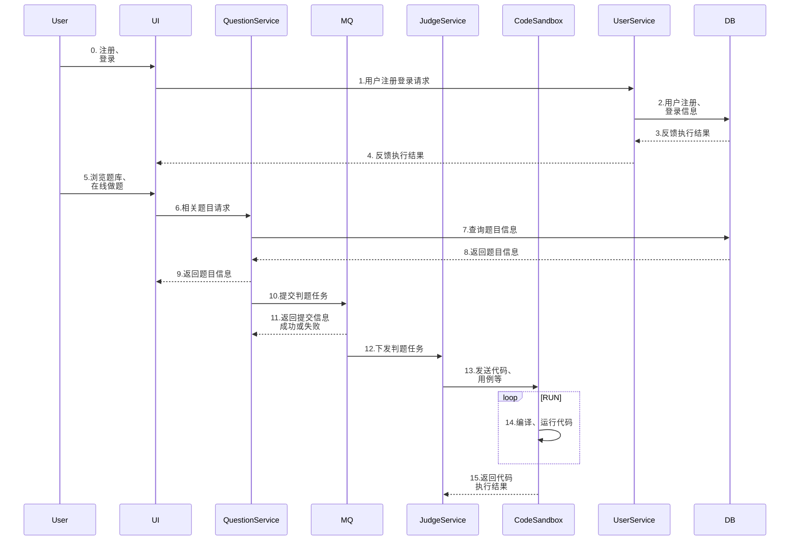

<div  style="display: flex; justify-content: center;">
     
     
     
     
</div>

<div style="display: flex; justify-content: center;">
    <div>
         
    </div>
    <div>
         
    </div>
    <div>
         
    </div>
    <div>
         
    </div>
</div>

<div style="display: flex; justify-content: center;">
    <div>
         
    </div>
    <div>
         
    </div>
    <div>
         
    </div>
    <div>
         
    </div>
    <div>
         
    </div>
    <div>
         
    </div>
</div>

​    

<h1 align="center">
    <p>
        <strong>一个还没有名字的在线判题系统</strong> 
    </p> 
    <p style="font-size: 10px; margin-top: 10px;">
        Author：<a href="https://github.com/LiangshouX" target="_blank">LiangshouX</a>
    </p>
</h1>

一个基于 Spring Boot + Spring Cloud 微服务架构和 Vue 3 + Arco Design 的编程题目在线评测系统。系统前台提供管理员创建和管理题目的功能，用户可以搜索、阅读题目，并编写并提交代码。系统后端根据管理员设定的题目测试用例，在自主实现的代码沙箱中对代码进行编译、运行，并判断输出是否正确。

代码沙箱可以作为独立服务，提供给其他开发者使用。


# Quick Start

如果您想在本地运行本项目，首先请确保以下环境已经准备就绪：

* Java
* mysql
* RabbitMQ
* Nacos(微服务后端)
* Redis
* NodeJs

### 拉取项目到本地

使用克隆命令：

```shell
git clone git@github.com:LiangshouX/bitoj.git
or
git clone https://github.com/LiangshouX/bitoj.git
```

或直接下载压缩包。


### 启动后端项目

后端项目有两种启动方式，您可以选择启动后端微服务 `bitoj-backend-microservice`，或者启动后端单体项目 `bitoj-backend`。

> :warning: 两种启动方式均需要启动代码沙箱 `bitoj-backend-microservice/bitoj-code-sandbox` 

#### 方式一：启动后端单体项目

1. 刷新 Maven 配置，等待依赖安装

2. 修改 `application.yml` 中的相关配置：

   ```yml
   spring:
     datasource:
       driver-class-name: com.mysql.cj.jdbc.Driver
       url: jdbc:mysql://localhost:3306/bit_oj
       username: XXX # 修改为您的数据库用户名
       password: XXX # 对应的密码
     # Redis 配置
     # todo 需替换配置，然后取消注释
     # redis:
     #  database: 1
     #  host: localhost
     #  port: 6379
     #  timeout: 5000
   ```

   > :warning: 如需使用 Redis 分布式服务，需注意检查、移除 `MainApplication` 启动类开头 `@SpringBootApplication` 注解内的 exclude 参数。如：
   >
   > 修改前：
   >
   > ```java
   > @SpringBootApplication(exclude = {RedisAutoConfiguration.class})
   > ```
   >
   > 修改后：
   >
   > ```java
   > @SpringBootApplication
   > ```

   

3. 执行 `sql/sql/create_table.sql` 中的数据库语句，自动创建库表 

4. 启动项目，访问 `http://localhost:8101/api/doc.html` 即可打开后端接口文档

5. 启动代码沙箱，开启远程判题功能


#### 方式二：启动后端微服务项目

1. 启动 Nacos 服务

   > 进入 Nacos 安装路径的 `bin` 目录下，执行以下命令启动 Nacos （针对 Windows系统）：
   >
   > ```shell
   > .\startup.cmd -m standalone
   > ```

   

2. 刷新 Maven 配置，并等待依赖安装

3. 同**方式一**修改配置、连接数据库并建表等

4. 依次启动以下5项服务：

   1. `BitojBackendGatewayApplication`
   2. `BitojBackendUserServiceApplication`
   3. `BitojBackendQuestionServiceApplication`
   4. ``BitojBackendJudgeServiceApplication``
   5. `BitojCodeSandboxApplication`


### 启动前端项目

运行前端项目需要安装 vue 框架，如未安装，请参考本项目 `./docs/开发日志-01-概述 & 前端项目初始化.md` 有关前端初始化-环境配置部分的内容。

使用 WebStorm 或 VSCode 打开项目后，先执行以下命令安装所需依赖：

```shell
yarn install
or
npm i
```

依赖安装完成后执行如下命令启动项目：

```shell
yarn serve
or
npm run serve
```


# 项目架构与模块设计


## 主要涉及的模块

用户、前端页面、后端控制(Controller)、题目服务(QuestionService)、消息队列(MQ)、判题服务(JudgeService)、代码沙箱(CodeSandbox)、数据库(DB)、用户服务(UserService)




## 项目核心业务流程：

1. {用户}通过{前端页面}访问系统，执行<注册>、<登录>等操作，相关请求发送给  {后端控制}，由 {用户服务(UserService)}  向数据库发起请求，获取到用户的注册登录信息后返回给 {后端控制}
2. {用户} 通过 {前端页面} 访问系统，进行<浏览题库>、<在线做题/提交代码>等操作，相关请求发送给 {后端控制}，
3. 对于 <浏览题库> 请求，{题目服务(QuestionService)} 则向{数据库}查询，{数据库} 返回题目信息；
4. 对于 <在线做题/提交代码>请求，{题目服务(QuestionService)} 首先将 《判题任务》提交给{消息队列(MQ)}，同时向{数据库}中写记录，{消息队列(MQ)} 向 {题目服务(QuestionService)} 返回提交信息成功或失败
5. {消息队列(MQ)} 向 {题目服务(QuestionService)} 返回提交信息成功后，将判题任务下发到 {判题服务(JudgeService)}
6.  {判题服务(JudgeService)}  收集、处理判题任务，发送到 {代码沙箱(CodeSandbox)}，由 {代码沙箱(CodeSandbox)} 进行编译、运行代码等
7. {代码沙箱(CodeSandbox)} 将执行结果返回给 {判题服务(JudgeService)}，{判题服务(JudgeService)} 根据规则判断执行信息是否符合预期，同时向 {数据库(DB)} 更新判题结果
8. {用户} 通过 {前端页面} 执行查询提交记录、搜索记录等操作，{前端页面} 通过{题目服务(QuestionService)} 向 {数据库(DB)} 发起请求，数据库将数据反馈给 {前端页面}


# 微服务设计


# 部署上线


# 后续扩展


