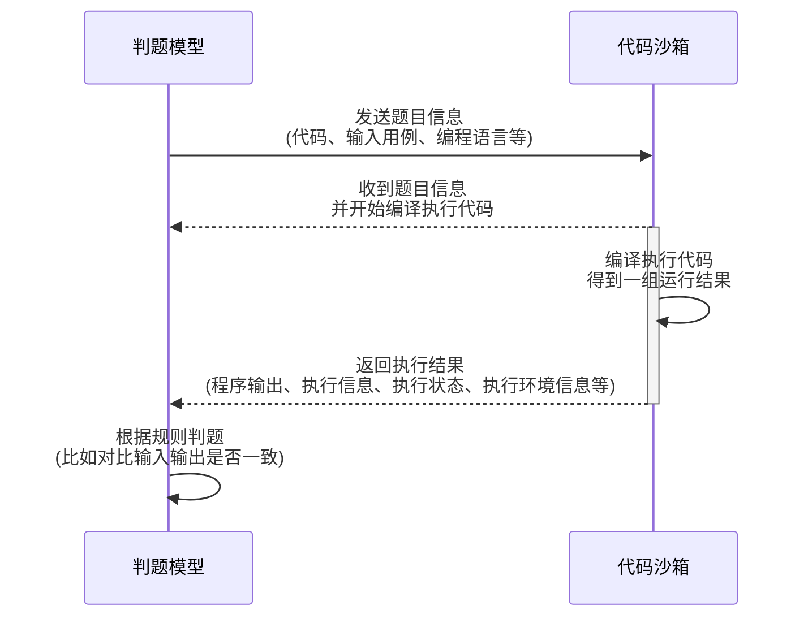
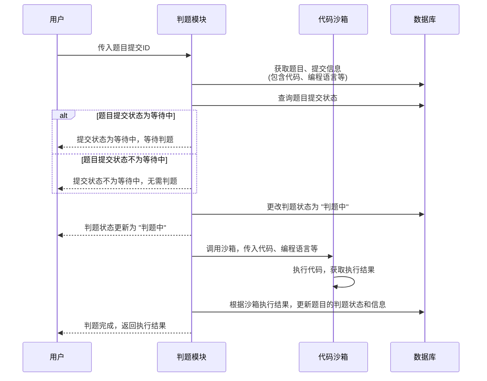
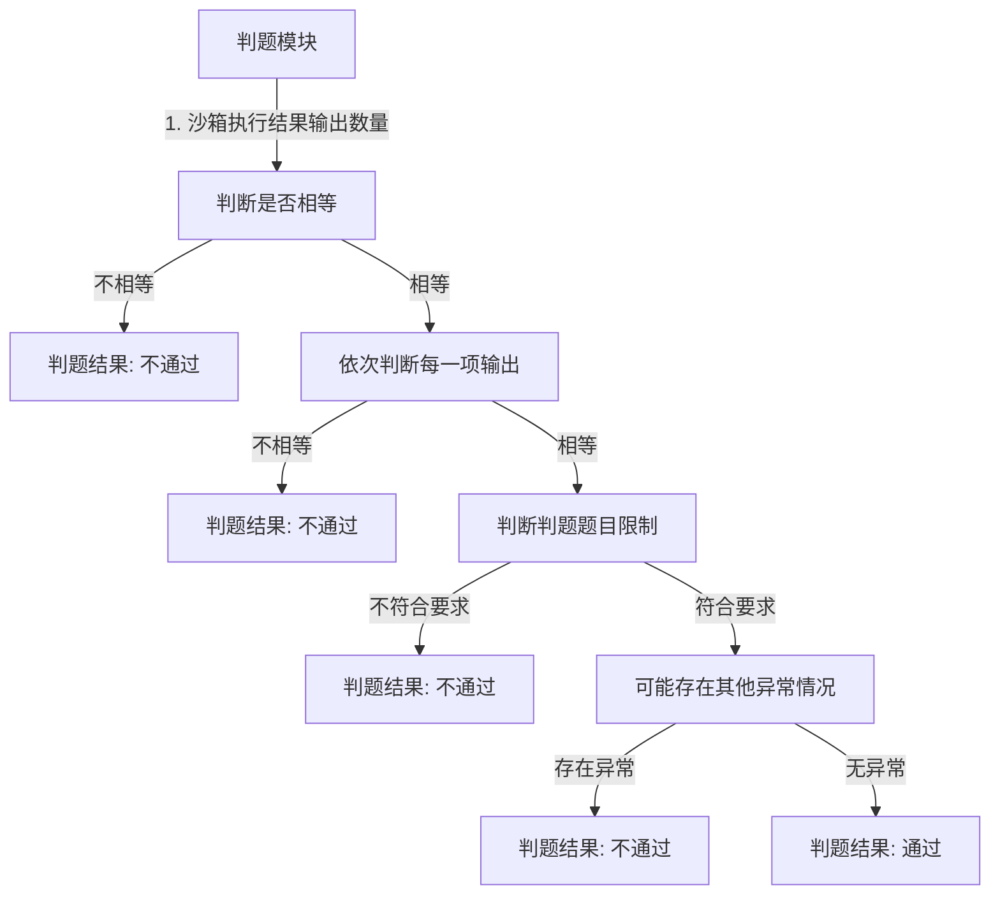

# 1. 前端页面开发与优化

## 1.1 题目相关页面

### **创建题目**页面优化


### 题目更新/修改页面优化

> 从 **题目管理** 页面导航过来


**管理题目**页面内的跳转函数：

```ts
const doUpdate = (question: Question) => {
  router.push({
    path: "/update/question",
    query: {
      id: question.id,
    },
  });
};
```


### **题目列表** 页面——搜索排列

1) 复制管理题目页的表格
2) 只保留需要的 columns 字段
3) 自定义表格列的渲染
   标签: 使用 tag 组件
   通过率:自行计算
   创建时间: 使用 moment 库进行格式化 (https://momentjs.com/docs/#/displaying/format/)
   操作按钮:补充跳转到做题页的按钮
4) 编写搜索表单，使用 form 的 layout = inline 布局，让用户的输入和 searchParams 同步，并且给提交按钮绑定修改 searchParams，从而被 watchEffect 监听到，触发查询


### **题目浏览** 页面

> :open_file_folder: src/views/question/ViewQuestionsView.vue

1. 定义动态路由参数，开启 props 为true。

   ```ts
   {
       path: "/question/view/:id",
       name: "在线做题",
       component: ViewQuestionsView,
       props: true, // 开启接收动态id
       meta: {
         access: [ACCESS_ENUM.USER, ACCESS_ENUM.ADMIN],
         hideInMenu: true,
       },
     },
   ```

2. 定义布局: 左侧是题目信息，右侧是代码编辑器

3. 左侧题目信息:

   * tabs 切换展示的内容
   * 定义 MdViewer 组件展示题目内容
   * 使用descriptions 组件展示判题配置 https://arco.design/vue/component/descriptions

4. 使用 select 组件让用户选择编程语言
   在代码编辑器中监听属性的变化，注意监听 props 要使用箭头函数https://blog.csdn.net/wuyxinu/article/details/124477647


## 1.2 用户相关页面

### 优化用户展示

> :open_file_folder: src/components/GlobalHeader.vue

将 `GlobalHeader` 展示用户信息的地方换为展示头像，同时头像组件设置下拉菜单，用于引向注册登录、或者用户信息查看修改。相关组件：

* 下拉菜单组件：https://arco.design/vue/component/dropdown
* 通用图标组件：https://arco.design/vue/component/icon

### 新建用户信息页

> :open_file_folder: src/views/user/UserInfoView.vue


### 修复注册登录bug


# 2. 判题机模块架构

## 2.1 判题模块与代码沙箱

* 判题模块: 调用代码沙箱，把代码和输入交给代码沙箱去执行
* 代码沙箱: 只负责接受代码和输入，返回编译运行的结果，不负责判题 (可以作为独立的项目，服务，提供给其也的需要执行代码的项目去使用)

这两个模块完全解耦:



:bulb: 思考: 为什么代码沙箱要接受和输出一组运行用例?
:memo: 前提: 我们的每道题目有多组测试用例
如果是每个用例单独调用一次代码沙箱，会调用多次接口、需要多次网络传输、程序要多次编译、记录程序的执行状态 (重复的代码不重复编译)
这是一种很常见的性能优化方法! (批处理)


## 2.2 代码沙箱架构开发

### 2.2-1 定义代码沙箱的接口

> :open_file_folder: oj/judge/codesandbox/CodeSandbox.java 

定义好沙箱接口能够提高通用性，之后的项目代码只调用接口，不调用具体的实现类，这样在你使用其他的代码沙箱实现类时，就不用去修改名称了，便于扩展。

> 代码沙箱的请求接口中，`timeLimit` 可加可不加，可自行扩展，即时中断程序
> 扩展思路: 增加一个查看代码沙箱状态的接口


### 2.2-2定义3种不同的代码沙箱实现

> :open_file_folder: oj/judge/codesandbox/impl

定义三种不同的沙箱实现：

1. 示例代码沙箱: 仅为了跑通业务流程
2. 远程代码沙箱:实际调用接口的沙箱
3. 第二方代码沙箱: 调用网上现成的代码沙箱，https://github.com/criyle/go-judge


### :label: 小知识：Lombok Builder注解

`Lombok` 是一个 Java 库，可以通过注解的方式来减少代码量，提高代码的可读性和可维护性。其中，`@Builder` 注解是 `Lombok` 提供的一个非常方便的注解，可以自动生成构建器模式的代码。

使用 `@Builder` 注解可以让我们在不编写繁琐的构造器代码的情况下，轻松地创建一个包含所有参数的构造器。使用示例：

```java
import lombok.Builder;
import lombok.Getter;

@Getter
@Builder
public class Person {
    private String name;
    private int age;
    private String address;
}

public class Main {
    public static void main(String[] args) {
        Person person = Person.builder()
                        .name("John")
                        .age(30)
                        .address("123 Main St")
                        .build();

        System.out.println(person.getName());
        System.out.println(person.getAge());
        System.out.println(person.getAddress());
    }
}

```

> :memo: 在这个例子中，`Person` 类使用了 `@Builder` 注解，这样就不需要手动编写一个繁琐的构造器。在 `Main` 类中，我们使用 `Person.builder()` 来创建一个 `Person` 对象，并使用链式调用的方式来设置对象的属性，最后通过 `build()` 方法来构建对象。
>
> `@Builder` 注解还可以配置一些参数，例如 `builderMethodName`、`buildMethodName`、`toBuilder` 等，可以根据实际需要来灵活配置。


#### 编写测试单元

> :open_file_folder: \src\test\java\com\liangshou\bitoj\judge\codesandbox\CodeSandboxTest.java

编写单元测试，验证单个代码沙箱的执行：

```java
@SpringBootTest
class CodeSandboxTest{
    
    @Test
    void executeCode() {
        CodeSandbox codeSandbox = new ExampleCodeSandbox();
        String code = "int main(){  }";
        String language = QuestionSubmitLanguageEnum.JAVA.getValue();
        List<String> inputList = Arrays.asList("1,2", "3,4");

        ExecuteCodeRequest executeCodeRequest = ExecuteCodeRequest.builder()
                .code(code)
                .inputList(inputList)
                .language(language)
                .build();

        ExecuteCodeResponse executeCodeResponse = codeSandbox.executeCode(executeCodeRequest);
        Assertions.assertNotNull(executeCodeResponse);
    }
}
```


### 2.2-3 使用工厂模式

使用工厂模式针对的问题是：以上把 mew 某个沙箱的代码写死了，例如测试单元中：`CodeSandbox codesandbox = new RemoteCodeSandbox()`，如果后面项目要改用其他沙箱，可能要改很多地方的代码。

根据用户传入的字符串参数 (沙箱类别)，来生成对应的代码沙箱实现类此处使用静态工厂模式，实现比较简单，符合我们的需求。

代码沙箱工厂的实现：

> :open_file_folder: oj/judge/codesandbox/CodeSandboxFactory.java

```java
/**
 * 代码沙箱工厂。根据字符串参数指定的代码沙箱实例
 */
public class CodeSandboxFactory {
    /**
     * 创建沙箱实例
     * @param type 沙箱类型
     * @return 沙箱实例
     */
    public static CodeSandbox newInstance(String type){
        switch (type){
            case "remote":
                return new RemoteCodeSandbox();
            case "thirdParty":
                return new ThirdPartyCodeSandbox();
            case "example":
            default:
                return new ExampleCodeSandbox();
        }
    }
}
```

如此，便可以根据字符串动态生成实例：

```java
public static void main(String[] args) {
        Scanner scanner = new Scanner(System.in);
        while (scanner.hasNext()){
            String type = scanner.next();
            CodeSandbox codeSandbox = CodeSandboxFactory.newInstance(type);
            String code = "int main(){  }";
            String language = QuestionSubmitLanguageEnum.JAVA.getValue();
            List<String> inputList = Arrays.asList("1,2", "3,4");

            ExecuteCodeRequest executeCodeRequest = ExecuteCodeRequest.builder()
                    .code(code)
                    .language(language)
                    .inputList(inputList)
                    .build();
            ExecuteCodeResponse executeCodeResponse = codeSandbox.executeCode(executeCodeRequest);

        }
    }
```


#### 参数配置化

承接上述工厂模式的设计思想，这里把项目中的一些*可以交给用户去自定义的选项或字符串*，写到配置文件中。这样开发者只需要改配置文件，而不需要去看你的项目代码，就能够自定义使用你项目的更多功能。实现分为两步：

1. `application.yml` 配置文件中指定变量：

   ```yml
   # 代码沙箱配置
   codesandbox:
   	type: example
   ```

2. 在Spring 的 Bean 中通过 `@Value` 注解读取变量值：

   ```java
   @Value("${codesandbox.type:exampe}")
   private String type;
   ```

#### 工厂模式增强


### 2.2-4 使用代理模式

> :open_file_folder: oj/judge/codesandbox/CodeSandboxProxy.java

代理模式的实现原理

1. 实现被代理的接口
2. 通过构造函数接受一个被代理的接门实现类
3. 调用被代理的接口实现类，在调用前后增加对应的操作

```java
@Slf4j
public class CodeSandboxProxy implements CodeSandbox{
    private final CodeSandbox codeSandbox;
    public CodeSandboxProxy(CodeSandbox codeSandbox){
        this.codeSandbox = codeSandbox;
    }
    @Override
    public ExecuteCodeResponse executeCode(ExecuteCodeRequest executeCodeRequest) {
        log.info("代码沙箱请求信息：" + executeCodeRequest.toString());
        ExecuteCodeResponse executeCodeResponse = codeSandbox.executeCode(executeCodeRequest);
        log.info("代码沙箱响应信息：" + executeCodeResponse.toString());
        return executeCodeResponse;
    }
}
```

使用方法：

```java
CodeSandbox codeSandbox = CodeSandboxFactory.newInstance(type);
codeSandbox = new CodeSandboxProxy(codeSandbox);
```


# 3. 判题服务开发

定义单独的judgeService 类，而不是把所有判题相关的代码写到 questionSubmitService 里，有利于后续的模
块抽离、微服务改造。


## 3.1 判题服务业务流程

1) 传入题目的提交 id，获取到对应的题目、提交信息 (包含代码、编程语言等)
2) 如果题目提交状态不为等待中，就不用重复执行了
3) 更改判题(题目提交)的状态为 “判题中”，防止重复执行，也能让用户即时看到状态
4) 调用沙箱，获取到执行结果
5) 根据沙箱的执行结果，设置题目的判题状态和信息

流程图：



## 3.2 判断逻辑

1. 先判断沙箱执行的结果输出数量是否和预期输出数量相等
2. 依次判断每一项输出和预期输出是否相等
3. 判题题目的限制是否符合要求
4. 可能还有其他的异常情况



## 3.3 策略模式优化

我们的判题策略可能会有很多种，比如：我们的代码沙箱本身执行程序需要消耗时间，这个时间可能不同的编程语言是不同的，比如沙箱执行 Java 要额外花 10 秒。

我们可以采用策略模式，针对不同的情况，定义独立的策略，便于分别修改策略和维护。而不是把所有的判题逻辑、if ... else ... 代码全部混在一起写

实现步骤如下：

### 定义判题策略接口

> :open_file_folder: oj/judge/strategy/JudgeStrategy.java

```java
/**
 * 判题策略
 */
public interface JudgeStrategy {

    /**
     * 执行判题
     * @param judgeContext 判题上下文
     * @return 判题信息
     */
    JudgeInfo doJudge(JudgeContext judgeContext);
}
```


### 定义判题上下文对象

> :open_file_folder: oj/judge/strategy/JudgeContext.java

```java
/**
 * 上下文（用于定义在策略中传递的参数）
 */
@Data
public class JudgeContext {

    private JudgeInfo judgeInfo;

    private List<String> inputList;

    private List<String> outputList;

    private List<JudgeCase> judgeCaseList;

    private Question question;

    private QuestionSubmit questionSubmit;

}
```


### 实现默认判题策略

> :open_file_folder: oj/judge/strategy/DefaultJudgeStrategy.java

```java
/**
 * 默认判题策略
 */
public class DefaultJudgeStrategy implements JudgeStrategy {

    /**
     * 执行判题
     * @param judgeContext 判题上下文对象
     * @return JudgeInfo
     */
    @Override
    public JudgeInfo doJudge(JudgeContext judgeContext) {
        JudgeInfo judgeInfo = judgeContext.getJudgeInfo();
        Long memory = judgeInfo.getMemory();
        Long time = judgeInfo.getTime();
        List<String> inputList = judgeContext.getInputList();
        List<String> outputList = judgeContext.getOutputList();
        Question question = judgeContext.getQuestion();
        List<JudgeCase> judgeCaseList = judgeContext.getJudgeCaseList();
        JudgeInfoMessageEnum judgeInfoMessageEnum = JudgeInfoMessageEnum.ACCEPTED;
        JudgeInfo judgeInfoResponse = new JudgeInfo();
        judgeInfoResponse.setMemory(memory);
        judgeInfoResponse.setTime(time);
        // 先判断沙箱执行的结果输出数量是否和预期输出数量相等
        if (outputList.size() != inputList.size()) {
            judgeInfoMessageEnum = JudgeInfoMessageEnum.WRONG_ANSWER;
            judgeInfoResponse.setMessage(judgeInfoMessageEnum.getValue());
            return judgeInfoResponse;
        }
        // 依次判断每一项输出和预期输出是否相等
        for (int i = 0; i < judgeCaseList.size(); i++) {
            JudgeCase judgeCase = judgeCaseList.get(i);
            if (!judgeCase.getOutput().equals(outputList.get(i))) {
                judgeInfoMessageEnum = JudgeInfoMessageEnum.WRONG_ANSWER;
                judgeInfoResponse.setMessage(judgeInfoMessageEnum.getValue());
                return judgeInfoResponse;
            }
        }
        // 判断题目限制
        String judgeConfigStr = question.getJudgeConfig();
        JudgeConfig judgeConfig = JSONUtil.toBean(judgeConfigStr, JudgeConfig.class);
        Long needMemoryLimit = judgeConfig.getMemoryLimit();
        Long needTimeLimit = judgeConfig.getTimeLimit();
        if (memory > needMemoryLimit) {
            judgeInfoMessageEnum = JudgeInfoMessageEnum.MEMORY_LIMIT_EXCEEDED;
            judgeInfoResponse.setMessage(judgeInfoMessageEnum.getValue());
            return judgeInfoResponse;
        }
        if (time > needTimeLimit) {
            judgeInfoMessageEnum = JudgeInfoMessageEnum.TIME_LIMIT_EXCEEDED;
            judgeInfoResponse.setMessage(judgeInfoMessageEnum.getValue());
            return judgeInfoResponse;
        }
        judgeInfoResponse.setMessage(judgeInfoMessageEnum.getValue());
        return judgeInfoResponse;
    }
}

```


### 再新增一种判题策略

> 新增Java语言判题策略 :open_file_folder: oj/judge/strategy/JavaLanguageJudgeStrategy.java


### 定义 `JudgeManager`

>  :open_file_folder: oj/judge/JudgeManager.java

```java
/**
 * 判题管理（简化调用）
 */
@Service
public class JudgeManager {

    /**
     * 执行判题
     *
     * @param judgeContext 判题上下文对象
     * @return JudgeInfo
     */
    JudgeInfo doJudge(JudgeContext judgeContext) {
        QuestionSubmit questionSubmit = judgeContext.getQuestionSubmit();
        String language = questionSubmit.getLanguage();
        JudgeStrategy judgeStrategy = new DefaultJudgeStrategy();
        if ("java".equals(language)) {
            judgeStrategy = new JavaLanguageJudgeStrategy();
        }
        return judgeStrategy.doJudge(judgeContext);
    }

}
```


# 4. 阶段成果


