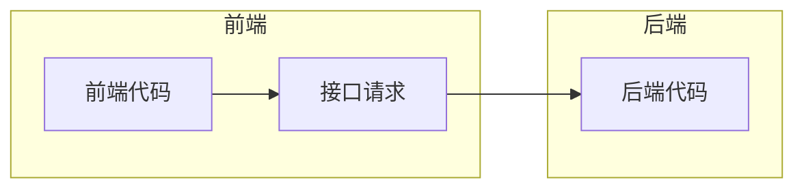

# 1. 后端初始化

> 拉取 [编程导航知识星球](https://t.zsxq.com/147srd088) 所提供的万用Java Spring后端模板，进行一些本地化配置。


```javascript
E:.
├─doc
│      
├─sql
│      create_table.sql	// 定义了数据库的初始化建库建表语句
│      post_es_mapping.json	// 帖子表在 ES 中的建表语句
│      
├─src
│  ├─main
│  │  ├─java
│  │  │  └─com
│  │  │      └─liangshou
│  │  │          └─bitoj
│  │  │              │  MainApplication.java // 项目启动入
│  │  │              │  
│  │  │              ├─annotation
│  │  │              │      
│  │  │              ├─aop // 用于全局权限校验、全局日志记录
│  │  │              │      
│  │  │              ├─common // 万用的类，比如通用响应类
│  │  │              │      
│  │  │              ├─config // 接收application.yml中的参数，初始化一些客户端的配置类
│  │  │              │      
│  │  │              ├─constant // 定义常量
│  │  │              │      
│  │  │              ├─controller // 接受请求
│  │  │              │      
│  │  │              ├─esdao // 类似 mybatis 的 mapper，用于操作 ES
│  │  │              │      
│  │  │              ├─exception // 异常处理相关
│  │  │              │      
│  │  │              ├─job // 任务相关(定时任务、单次任务)
│  │  │              │          
│  │  │              ├─manager // 服务层 (一般是定义一些公用的服务、对接第三方 API 等)
│  │  │              │      
│  │  │              ├─mapper // mybatis 的数据访问层，用于操作数据库
│  │  │              │      
│  │  │              ├─model // 数据模型、实体类、包装类、枚举值
│  │  │              │  ├─dto
│  │  │              │  │  ├─file
│  │  │              │  │  │      
│  │  │              │  │  ├─post
│  │  │              │  │  │      
│  │  │              │  │  ├─postfavour
│  │  │              │  │  │      
│  │  │              │  │  ├─postthumb
│  │  │              │  │  │      
│  │  │              │  │  └─user
│  │  │              │  │          
│  │  │              │  ├─entity
│  │  │              │  │      
│  │  │              │  ├─enums
│  │  │              │  │      
│  │  │              │  └─vo
│  │  │              │          
│  │  │              ├─service // 服务层，用于编写业务逻辑
│  │  │              │  │  
│  │  │              │  └─impl
│  │  │              │          
│  │  │              ├─utils // 工具类，各种各样公用的方法
│  │  │              │      
│  │  │              └─wxmp // 公众号相关的包
│  │  │                  │  
│  │  │                  └─handler
│  │  │                          
│  │  └─resources
│  │      │  application-prod.yml
│  │      │  application-test.yml
│  │      │  application.yml
│  │      │  
│  │      ├─mapper
│  │      │      
│  │      └─META-INF
│  │              
│  └─test  // 单元测试
│                              
└─target
    
```


# 2. 前后端联调

## 2.1 环境准备

前端和后端怎么连接起来的?  ==>  通过 `接口` + `请求` == > **前端发送请求**调用**后端接口**



### 使用代码生成器原生代码

1) 安装请求工具类 Axios
   官方文档: https://axios-http.com/docs/intro

2) 编写调用后端的代码

   传统情况下，每个请求都要单独编写代码。至少得写一个请求路径.

   完全不用! ! ! 直接自动生成即可

   > 参考工具官网： https://github.com/ferdikoomen/openapi-typescript-codegen

   首先安装:

   ```shell
   npm install openapi-typescript-codegen --save-dev
   ```

   

   然后执行命令生成代码：

   ```shell
   openapi --input http://localhost:xxxx/api/v2/api-docs --output ./generated --client axios
   ```

3) 直接使用生成的 `Service` 代码，直接调用函数发送请求即可。例如获取登录信息：

   > src/store/user.ts

   ```typescript
   export default {
     namespaced: true,
     state: () => ({
       loginUser: {
         userName: "未登录",
       },
     }),
     actions: {
       async getLoginUser({ commit, state }) {
         // 从远程请求获取登录信息
         const res = await UserControllerService.getLoginUserUsingGet();
         if (res.code === 0) {
           commit("updateUser", res.data);
         } else {
           commit("updateUser", {
             ...state.loginUser,
             userRole: ACCESS_ENUM.NOT_LOGIN,
           });
         }
       },
     },
     mutations: {
       updateUser(state, payload) {
         state.loginUser = payload;
       },
     },
   } as StoreOptions<any>;
   ```


### 自定义请求参数

1. 使用代码生成器提供的全局参数修改对象

   > generated/core/OpenAPI.ts

   ```typescript
   export const OpenAPI: OpenAPIConfig = {
       BASE: 'http://localhost:8101',
       VERSION: '1.0',
       WITH_CREDENTIALS: true,
       CREDENTIALS: 'include',
       TOKEN: undefined,
       USERNAME: undefined,
       PASSWORD: undefined,
       HEADERS: undefined,
       ENCODE_PATH: undefined,
   };
   
   ```

   

2. 直接定义 `axios` 请求库的全局参数，比如全局请求响应拦截器等。

   > 参考：https://axios-http.com/docs/interceptors

   ```typescript
   // 携带凭证
   OpenAPI.WITH_CREDENTIALS = true;
   const baseUrl =
     process.env.NODE_ENV === "development"
       ? "http://localhost:8101"
       : "http://10.63.224.46:8101";
   
   OpenAPI.BASE = baseUrl;
   console.log("当前环境：", process.env.NODE_ENV, "请求地址", baseUrl);
   
   // 添加请求拦截器
   axios.interceptors.request.use(
     function (config) {
       // 在发送请求之前做些什么
       return config;
     },
     function (error) {
       // 对请求错误做些什么
       return Promise.reject(error);
     }
   );
   
   // 添加响应拦截器
   axios.interceptors.response.use(
     function (response) {
       console.log("全局响应", response);
       // 2xx 范围内的状态码都会触发该函数。
       // 对响应数据做点什么
       return response;
     },
     function (error) {
       // 超出 2xx 范围的状态码都会触发该函数。
       // 对响应错误做点什么
       return Promise.reject(error);
     }
   );
   
   ```

   


## 2.2 用户登录

### 自动登录

1. 在 stor/user.ts 中编写代码

   ```ts
   ```

2. 


### 关于 vuex 的 dispatch

> Vuex 库的官方地址：https://vuex.vuejs.org/zh/

[dispatch](https://vuex.vuejs.org/zh/api/#dispatch)

- `dispatch(type: string, payload?: any, options?: Object): Promise<any>`
- `dispatch(action: Object, options?: Object): Promise<any>`

分发 action。`options` 里可以有 `root: true`，它允许在[命名空间模块](https://vuex.vuejs.org/zh/guide/modules.html#命名空间)里分发根的 action。返回一个解析所有被触发的 action 处理器的 Promise。[详细介绍](https://vuex.vuejs.org/zh/guide/actions)。


