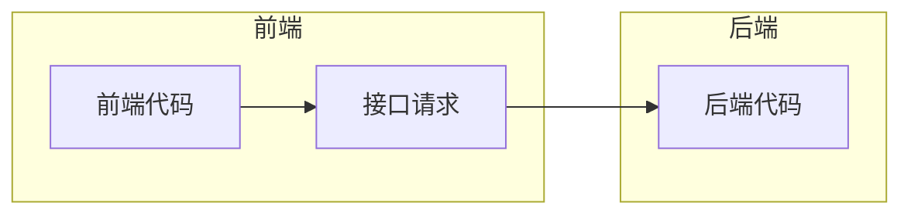

# 后端初始化

> 拉取 [编程导航知识星球](https://t.zsxq.com/147srd088) 所提供的万用Java Spring后端模板，进行一些本地化配置。


```shell
E:.
├─doc
│      
├─sql
│      create_table.sql	// 定义了数据库的初始化建库建表语句
│      post_es_mapping.json	// 帖子表在 ES 中的建表语句
│      
├─src
│  ├─main
│  │  ├─java
│  │  │  └─com
│  │  │      └─liangshou
│  │  │          └─bitoj
│  │  │              │  MainApplication.java // 项目启动入
│  │  │              │  
│  │  │              ├─annotation
│  │  │              │      
│  │  │              ├─aop // 用于全局权限校验、全局日志记录
│  │  │              │      
│  │  │              ├─common // 万用的类，比如通用响应类
│  │  │              │      
│  │  │              ├─config // 接收application.yml中的参数，初始化一些客户端的配置类
│  │  │              │      
│  │  │              ├─constant // 定义常量
│  │  │              │      
│  │  │              ├─controller // 接受请求
│  │  │              │      
│  │  │              ├─esdao // 类似 mybatis 的 mapper，用于操作 ES
│  │  │              │      
│  │  │              ├─exception // 异常处理相关
│  │  │              │      
│  │  │              ├─job // 任务相关(定时任务、单次任务)
│  │  │              │          
│  │  │              ├─manager // 服务层 (-般是定义一些公用的服务、对接第三方 API 等)
│  │  │              │      
│  │  │              ├─mapper // mybatis 的数据访问层，用于操作数据库
│  │  │              │      
│  │  │              ├─model // 数据模型、实体类、包装类、枚举值
│  │  │              │  ├─dto
│  │  │              │  │  ├─file
│  │  │              │  │  │      
│  │  │              │  │  ├─post
│  │  │              │  │  │      
│  │  │              │  │  ├─postfavour
│  │  │              │  │  │      
│  │  │              │  │  ├─postthumb
│  │  │              │  │  │      
│  │  │              │  │  └─user
│  │  │              │  │          
│  │  │              │  ├─entity
│  │  │              │  │      
│  │  │              │  ├─enums
│  │  │              │  │      
│  │  │              │  └─vo
│  │  │              │          
│  │  │              ├─service // 服务层，用于编写业务逻辑
│  │  │              │  │  
│  │  │              │  └─impl
│  │  │              │          
│  │  │              ├─utils // 工具类，各种各样公用的方法
│  │  │              │      
│  │  │              └─wxmp // 公众号相关的包
│  │  │                  │  
│  │  │                  └─handler
│  │  │                          
│  │  └─resources
│  │      │  application-prod.yml
│  │      │  application-test.yml
│  │      │  application.yml
│  │      │  
│  │      ├─mapper
│  │      │      
│  │      └─META-INF
│  │              
│  └─test  // 单元测试
│                              
└─target
    
```


# 前后端联调

## 环境准备

前端和后端怎么连接起来的?  => 接口+请求 = > 前端发送请求调用后端接口




1)安装请求工具类 Axios
官方文档: https://axios-http.com/docs/intro

编写调用后端的代码
传统情况下，每个请求都要单独编写代码。至少得写一个请求路径完全不用! ! !
直接自动生成即可: https://github.com/ferdikoomen/openapi-typescript-codegen首先安装:

```shell
npm install openapi-typescript-codegen --save-dev
```


## 用户登录

### 自动登录

1. 在 stor/user.ts 中编写代码

   ```ts
   ```

   


