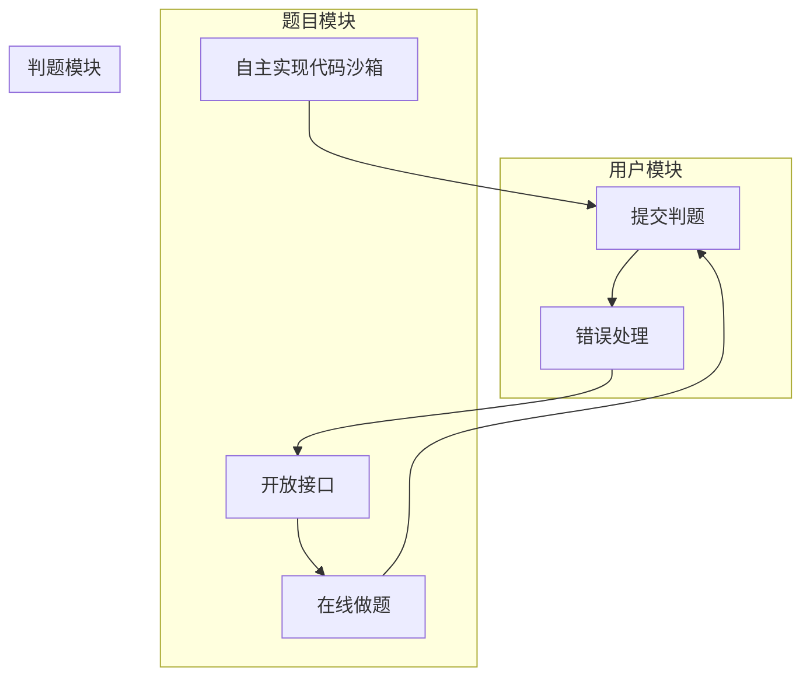

1. 用户模块
   a. 注册(后端已实现)
   b. 登录(后端已实现，前端已实现)
2. 题目模块
   a. 创建题目 (管理员)
   b. 删除题目(管理员)
   c. 修改题目 (管理员)
   d. 搜索题目 (用户)
   e. 在线做题(题目详情页
3. 判题模块
   a. 提交判题(结果是否正确与错误)
   b. 错误处理(内存溢出、安全性、超时)
   c. 自主实现 代码沙箱 (安全沙箱
   d. 开放接口(提供一个独立的新服务

# 库表设计


## 题目表

```mysql
-- 题目表
create table if not exists question
(
    id          bigint auto_increment comment 'id' primary key,
    title       varchar(512)                       null comment '标题',
    content     text                               null comment '内容',
    tags        varchar(1024)                      null comment '标签列表（json 数组）',
    answer      text                               null comment '题目答案',
    submitNum   int      default 0                 not null comment '题目提交数',
    acceptedNum int      default 0                 not null comment '题目通过数',
    judgeCase   text                               null comment '判题用例（json 数组）',
    judgeConfig text                               null comment '判题配置（json 对象）',
    thumbNum    int      default 0                 not null comment '点赞数',
    favourNum   int      default 0                 not null comment '收藏数',
    userId      bigint                             not null comment '创建用户 id',
    createTime  datetime default CURRENT_TIMESTAMP not null comment '创建时间',
    updateTime  datetime default CURRENT_TIMESTAMP not null on update CURRENT_TIMESTAMP comment '更新时间',
    isDelete    tinyint  default 0                 not null comment '是否删除',
    index idx_userId (userId)
) comment '题目' collate = utf8mb4_unicode_ci
```

## 题目提交表

```mysql
-- 题目提交表
create table if not exists question_submit
(
    id         bigint auto_increment comment 'id' primary key,
    language   varchar(128)                       not null comment '编程语言',
    code       text                               not null comment '用户代码',
    judgeInfo  text                               null comment '判题信息（json 对象）',
    status     int      default 0                 not null comment '判题状态（0 - 待判题、1 - 判题中、2 - 成功、3 - 失败）',
    questionId bigint                             not null comment '题目 id',
    userId     bigint                             not null comment '创建用户 id',
    createTime datetime default CURRENT_TIMESTAMP not null comment '创建时间',
    updateTime datetime default CURRENT_TIMESTAMP not null on update CURRENT_TIMESTAMP comment '更新时间',
    isDelete   tinyint  default 0                 not null comment '是否删除',
    index idx_questionId (questionId),
    index idx_userId (userId)
) comment '题目提交';
```


# 后端接口开发

> 1) 根据功能设计库表
> 2) 自动生成对数据库基本的增删改查 (mapper 和 service 层的基本功能)
> 3) 编写 Controller 层，实现基本的增删改查和权限校验 (复制粘贴)
> 4) 去根据业务定制开发新的功能，编写新的代码


## 根据库表生成实体类、Service类等

首先根据编写的 `Question` 表 和 `QuestionSubmit` 表，借助MyBatis X插件自动生成相应的实体类、Mapper类、Service类等，并重构到项目相应的位置。


## 编写枚举类

### 判题信息消息枚举


```java
	ACCEPTED("成功", "Accepted"),
    WRONG_ANSWER("答案错误", "Wrong Answer"),
    COMPILE_ERROR("Compile Error", "编译错误"),
    MEMORY_LIMIT_EXCEEDED("", "内存溢出"),
    TIME_LIMIT_EXCEEDED("Time Limit Exceeded", "超时"),
    PRESENTATION_ERROR("Presentation Error", "展示错误"),
    WAITING("Waiting", "等待中"),
    OUTPUT_LIMIT_EXCEEDED("Output Limit Exceeded", "输出溢出"),
    DANGEROUS_OPERATION("Dangerous Operation", "危险操作"),
    RUNTIME_ERROR("Runtime Error", "运行错误"),
    SYSTEM_ERROR("System Error", "系统错误");
```


### 题目提交编程语言枚举


```java
    JAVA("java", "java"),
    CPLUSPLUS("c++", "c++"),
    GOLANG("golang", "golang");
```


### 题目提交枚举


```java
    WAITING("等待中", 0),
    RUNNING("判题中", 1),
    SUCCEED("成功", 2),
    FAILED("失败", 3);
```


## 编写Controller层

> Controller（控制器）是MVC（Model-View-Controller）架构中的一部分，负责处理用户请求、调用服务层逻辑，然后返回相应的视图或数据给客户端。Controller主要用于接收和处理用户请求，将请求委托给服务层进行业务逻辑处理，并最终返回响应给客户端。

在 `Controller` 层中添加新增的与题目有关的接口类 `QuestionController` 与 `QuestionSubmitController`，在  `QuestionController` 中定义题目增删改查相关的业务逻辑代码，在 `QuestionSubmitController` 中定义题目提交相关的业务逻辑代码。需配合后续实现进行。

### `QuestionController` 题目接口


### `QuestionSubmitController` 题目提交接口


## 编写Model层——dto、vo

> 1. 在Spring开发中，DTO（Data Transfer Object）是一种设计模式，用于在不同层之间传输数据。通常，DTO包下的`.java`文件包含一些用于数据传输的类，用于在不同层（如Controller、Serveice、持久层）之间传递数据而不暴露底层实体的细节。
> 2. VO（View Object）则通常用于表示视图层（前端）所需的数据对象。VO主要用于封装页面显示所需的信息，以便更好地满足前端页面的展示需求。

### `dto` 包

在 `dto` 包下分别新建 `question` 包和 `questionsubmit` 包（可通过复制模板已有的 post 和 postthumb 包 + 调整 来实现），前者编写**题目的增删改查请求**，后者编写 **题目提交的添加和查询请求**。

```shell
├─question
│      JudgeCase.java
│      JudgeConfig.java
│      QuestionAddRequest.java
│      QuestionEditRequest.java
│      QuestionQueryRequest.java
│      QuestionUpdateRequest.java
│
├─questionsubmit
│      QuestionSubmitAddRequest.java
│      QuestionSubmitQueryRequest.java
```

#### `question` 包

> 此包与题目的增删改查业务逻辑相关

1. `QuestionAddRequest` 

   保留字段：标题、内容、标签列表、题目答案、判题用例、判题配置

2. `QuestionEditRequest `

   在`QuestionAddRequest `的基础上多保留 id 字段

3. `QuestionQueryRequest `

   保留字段：id、标题、标签列表、题目答案、创建用户ID

4. `QuestionUpdateRequest`

   与`QuestionEditRequest `保留字段一致。

#### `question` 包

> 此包与题目提交的添加和查询请求有关

1. `QuestionSubmitAddRequest`

   保留字段：编程语言、用户代码、题目id

2. `QuestionSubmitQueryRequest`

   保留字段：编程语言、提交状态（判题状态）、题目id、用户id

### `vo` 包

```shell
└─vo
        QuestionSubmitVO.java
        QuestionVO.java
```

#### `QuestionVO`

保留字段：

分别定义**包装类转对象**  与**对象转包装类** 的方法：

```java
public static Question voToObj(QuestionVO questionVO) {
        if (questionVO == null) {
            return null;
        }
        
        Question question = new Question();
        BeanUtils.copyProperties(questionVO, question);
        List<String> tagList = questionVO.getTags();
        
        if(tagList != null){
            question.setTags(JSONUtil.toJsonStr(tagList));
        }

        JudgeConfig voJudgeConfig = questionVO.getJudgeConfig();
        
        if(voJudgeConfig != null){
            question.setJudgeConfig(JSONUtil.toJsonStr(voJudgeConfig));
        }
        
        return question;
    }
```

```java
public static QuestionVO objToVo(Question question) {
        if (question == null) {
            return null;
        }

        QuestionVO questionVO = new QuestionVO();
        BeanUtils.copyProperties(question, questionVO);
        List<String> tagList = JSONUtil.toList(question.getTags(), String.class);
        questionVO.setTags(tagList);

        String judgeConfigStr = question.getJudgeConfig();
        questionVO.setJudgeConfig(JSONUtil.toBean(judgeConfigStr, JudgeConfig.class));

        return questionVO;
    }
```


#### `QuestionSubmitVO`

大致同 `QuestionVO`，具体代码如下。

> :warning: 注意在 `questionsubmit` 包下创建 `JudgeInfo ` 类。

```java
public static QuestionSubmit voToObj(QuestionSubmitVO questionSubmitVO) {
        if (questionSubmitVO == null) {
            return null;
        }

        QuestionSubmit questionSubmit = new QuestionSubmit();
        BeanUtils.copyProperties(questionSubmitVO, questionSubmit);
        JudgeInfo judgeInfo1Obj = questionSubmitVO.getJudgeInfo();
        if (judgeInfo1Obj != null){
            questionSubmit.setJudgeInfo(JSONUtil.toJsonStr(judgeInfo1Obj));
        }

        return questionSubmit;
    }
```

```java
public static QuestionSubmitVO objToVo(QuestionSubmit questionSubmit) {
        if (questionSubmit == null) {
            return null;
        }

        QuestionSubmitVO questionSubmitVO = new QuestionSubmitVO();
        BeanUtils.copyProperties(questionSubmit, questionSubmitVO);
        String judgeInfoStr = questionSubmit.getJudgeInfo();
        questionSubmitVO.setJudgeInfo(JSONUtil.toBean(judgeInfoStr, JudgeInfo.class));

        return questionSubmitVO;
    }
```


## 编写Service层

### `QuestionService`

接口中需定义以下功能，并在实现类中实现：

```java
	/**
     * 校验
     */
    void validQuestion(Question question, boolean add);

    /**
     * 获取查询条件
     */
    QueryWrapper<Question> getQueryWrapper(QuestionQueryRequest questionQueryRequest);

    /**
     * 获取题目封装
     */
    QuestionVO getQuestionVO(Question question, HttpServletRequest request);

    /**
     * 分页获取题目封装
     */
    Page<QuestionVO> getQuestionVOPage(Page<Question> questionPage, HttpServletRequest request);

```


### `QuestionSubmitService`

接口中需定义以下功能，并在实现类中实现：

```java
```


