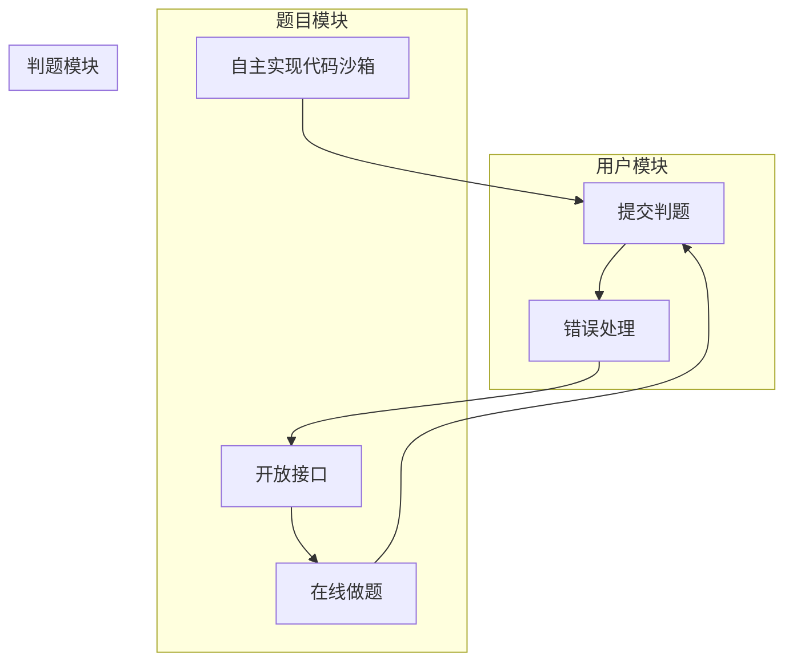

1. 用户模块
   a. 注册(后端已实现)
   b. 登录(后端已实现，前端已实现)
2. 题目模块
   a. 创建题目 (管理员)
   b. 删除题目(管理员)
   c. 修改题目 (管理员)
   d. 搜索题目 (用户)
   e. 在线做题(题目详情页
3. 判题模块
   a. 提交判题(结果是否正确与错误)
   b. 错误处理(内存溢出、安全性、超时)
   c. 自主实现 代码沙箱 (安全沙箱
   d. 开放接口(提供一个独立的新服务

# 库表设计


## 题目表

```mysql
-- 题目表
create table if not exists question
(
    id          bigint auto_increment comment 'id' primary key,
    title       varchar(512)                       null comment '标题',
    content     text                               null comment '内容',
    tags        varchar(1024)                      null comment '标签列表（json 数组）',
    answer      text                               null comment '题目答案',
    submitNum   int      default 0                 not null comment '题目提交数',
    acceptedNum int      default 0                 not null comment '题目通过数',
    judgeCase   text                               null comment '判题用例（json 数组）',
    judgeConfig text                               null comment '判题配置（json 对象）',
    thumbNum    int      default 0                 not null comment '点赞数',
    favourNum   int      default 0                 not null comment '收藏数',
    userId      bigint                             not null comment '创建用户 id',
    createTime  datetime default CURRENT_TIMESTAMP not null comment '创建时间',
    updateTime  datetime default CURRENT_TIMESTAMP not null on update CURRENT_TIMESTAMP comment '更新时间',
    isDelete    tinyint  default 0                 not null comment '是否删除',
    index idx_userId (userId)
) comment '题目' collate = utf8mb4_unicode_ci
```

## 题目提交表

```mysql
-- 题目提交表
create table if not exists question_submit
(
    id         bigint auto_increment comment 'id' primary key,
    language   varchar(128)                       not null comment '编程语言',
    code       text                               not null comment '用户代码',
    judgeInfo  text                               null comment '判题信息（json 对象）',
    status     int      default 0                 not null comment '判题状态（0 - 待判题、1 - 判题中、2 - 成功、3 - 失败）',
    questionId bigint                             not null comment '题目 id',
    userId     bigint                             not null comment '创建用户 id',
    createTime datetime default CURRENT_TIMESTAMP not null comment '创建时间',
    updateTime datetime default CURRENT_TIMESTAMP not null on update CURRENT_TIMESTAMP comment '更新时间',
    isDelete   tinyint  default 0                 not null comment '是否删除',
    index idx_questionId (questionId),
    index idx_userId (userId)
) comment '题目提交';
```


# 后端接口开发

## 根据库表生成实体类、Service类等


## 编写Controller层


## 编写Model层——dto、vo


## 编写Service层


