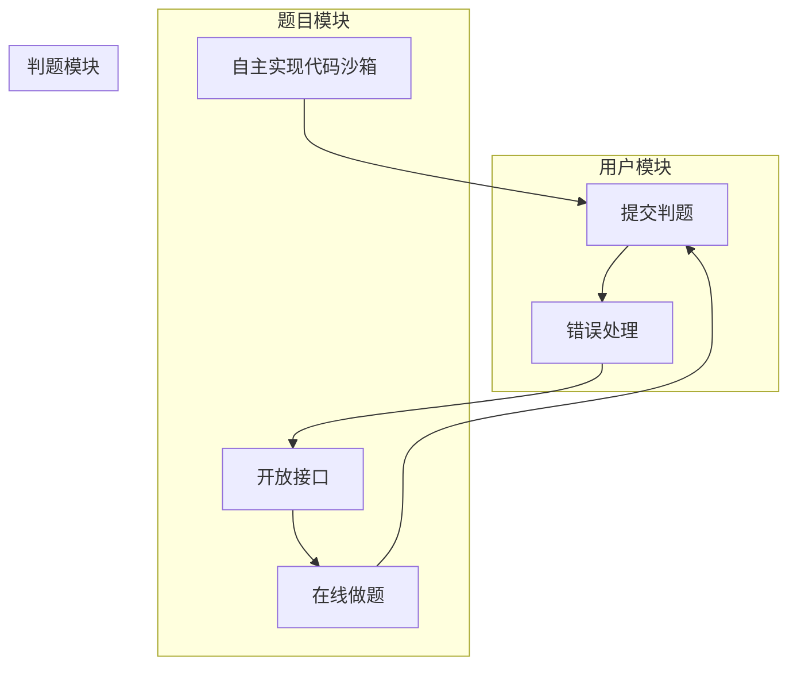

**:bulb: 项目进度一览**

1. 用户模块
   a. 注册(后端已实现)
   b. 登录(后端已实现，前端已实现)
2. 题目模块
   a. 创建题目 (管理员)
   b. 删除题目(管理员)
   c. 修改题目 (管理员)
   d. 搜索题目 (用户)
   e. 在线做题(题目详情页)
3. 判题模块
   a. 提交判题(结果是否正确与错误)
   b. 错误处理(内存溢出、安全性、超时)
   c. 自主实现 代码沙箱 (安全沙箱
   d. 开放接口(提供一个独立的新服务

# 1. 库表设计

用户表等已在模板中实现，无需太大改动。主要设计 **题目表** 和 **题目提交表** 。

## 题目表

题目表主要考虑的字段：

1. **题目标题**

2. **题目内容**: 存放题目的介绍、输入输出提示、描述、具体的详情

3. **题目标签** (json 数组字符串) :  例如栈、队列、链表、简单、中等、困难等

4. **题目答案**: 管理员、用户设置的参考答案/题解

5. **提交数**、**通过题目的人数**等: 便于分析统计 (可以考虑根据通过率自动给题目打难易度签)

6. 判题相关字段:

   > 如果说题目不是很复杂，用例文件大小不大的话，可以直接存在数据库表里但是如果用例文件比较大，>512 KB 建议单独存放在一个文件中，数据库中只保存文件url(类似存储用户头像)

   1. **JudgeCase**：测试用例（json数组）

      > 每个元素是一个输入用例对应一个输出用例，例如：
      >
      > ```json
      > [
      >     {
      >         "input" :"1 2",
      >         "output":"3 4"
      >     },
      >     {
      >         "input":"1 3",
      >         "output":"2 4"
      >     }
      > ]
      > ```
      > 
      >
      
   2. **JudgeConfig**：判题配置（json对象），如时间限制、内存限制
   
      > 存 json 的好处在于：**便于扩展**，只需要改变对象内部的字段，而不用修改数据库表(可能会影响数据库)
      >
      > ```json
      > {
      >  	"timeLimit": 1000,
      > 	"memoryLimit":1009,
      > 	"stackLimit": 1009
      > }
      > ```
      >
      
      
      
      > 存 json 的前提
      >
      > 1. 你不需要根据某个字段去倒查这条数据
      > 2. 你的字段含义相关，属于同一类的值
      > 3. 你的字段存储空间占用不能太大

```mysql
-- 题目表
create table if not exists question
(
    id          bigint auto_increment comment 'id' primary key,
    title       varchar(512)                       null comment '标题',
    content     text                               null comment '内容',
    tags        varchar(1024)                      null comment '标签列表（json 数组）',
    answer      text                               null comment '题目答案',
    submitNum   int      default 0                 not null comment '题目提交数',
    acceptedNum int      default 0                 not null comment '题目通过数',
    judgeCase   text                               null comment '判题用例（json 数组）',
    judgeConfig text                               null comment '判题配置（json 对象）',
    thumbNum    int      default 0                 not null comment '点赞数',
    favourNum   int      default 0                 not null comment '收藏数',
    userId      bigint                             not null comment '创建用户 id',
    createTime  datetime default CURRENT_TIMESTAMP not null comment '创建时间',
    updateTime  datetime default CURRENT_TIMESTAMP not null on update CURRENT_TIMESTAMP comment '更新时间',
    isDelete    tinyint  default 0                 not null comment '是否删除',
    index idx_userId (userId)
) comment '题目' collate = utf8mb4_unicode_ci
```

## 题目提交表

此表主要存放 哪个用户提交了哪道题目、判题结果等数据。主要考虑的字段：

1. 提交用户 id: userld

2. 题目id: questionld

3. 语言: language

4. 用户的代码: code

5. 判题状态: status (0 - 待判题、1 - 判题中、2- 成功、3 - 失败)

6. 判题信息(判题过程中得到的一些信息，比如程序的失败原因、程序执行消耗的时间空间)，枚举值

7. judgelnfo （json 对象）

   > ```json
   > {
   >     "message":"程序执行信息",
   >     "time": 1090, // 存储单位为ms
   >     "memory": 1090，// 单位为 kb
   > }
   > ```
   >
   > :bulb: 判题信息的枚举值参考 **接口开发** 部分的 **枚举类编写**。

```mysql
-- 题目提交表
create table if not exists question_submit
(
    id         bigint auto_increment comment 'id' primary key,
    language   varchar(128)                       not null comment '编程语言',
    code       text                               not null comment '用户代码',
    judgeInfo  text                               null comment '判题信息（json 对象）',
    status     int      default 0                 not null comment '判题状态（0 - 待判题、1 - 判题中、2 - 成功、3 - 失败）',
    questionId bigint                             not null comment '题目 id',
    userId     bigint                             not null comment '创建用户 id',
    createTime datetime default CURRENT_TIMESTAMP not null comment '创建时间',
    updateTime datetime default CURRENT_TIMESTAMP not null on update CURRENT_TIMESTAMP comment '更新时间',
    isDelete   tinyint  default 0                 not null comment '是否删除',
    index idx_questionId (questionId),
    index idx_userId (userId)
) comment '题目提交';
```

> :memo:  **数据库索引 tips**
>
> 问：什么情况下适合加索引? 如何选择给哪个字段加索引?
>
> 答: 首先从业务出发，无论是单个索引、还是联合索引，都要从你实际的查询语句、字段枚举值的区分度、字段的类型考虑 (where 条件指定的字段)
>
> 比如:  where userld = 1 and questionld = 2 
>
> 可以选择根据 userld 和 questionld 分别建立索引 (需要分别根据这两个字段单独查询)，也可以选择给这两个字段建立联合索引(所查询的字段是绑定在一起的)原则上: 能不用索引就不用索引;能用单个索引就别用联合/多个索引;不要给没区分度的字段加索引(比如性别，就男/女)。因为索引也是要占用空间的。


# 2. 后端接口开发

> 后端接口开发流程：
>
> 1) 根据功能设计库表
> 2) 自动生成对数据库基本的增删改查 (mapper 和 service 层的基本功能)
> 3) 编写 Controller 层，实现基本的增删改查和权限校验 (复制粘贴)
> 4) 去根据业务定制开发新的功能，编写新的代码


## 2.1 根据库表生成实体类、Service类等

首先根据编写的 `Question` 表 和 `QuestionSubmit` 表，借助MyBatis X插件自动生成相应的实体类、Mapper类、Service类等，并重构到项目相应的位置。


## 2.2 编写枚举类

### 2.2-1 判题信息消息枚举

> :open_file_folder: /bitoj/model/enums/JudgeInfoMessageEnum.java

```java
	ACCEPTED("成功", "Accepted"),
    WRONG_ANSWER("答案错误", "Wrong Answer"),
    COMPILE_ERROR("Compile Error", "编译错误"),
    MEMORY_LIMIT_EXCEEDED("", "内存溢出"),
    TIME_LIMIT_EXCEEDED("Time Limit Exceeded", "超时"),
    PRESENTATION_ERROR("Presentation Error", "展示错误"),
    WAITING("Waiting", "等待中"),
    OUTPUT_LIMIT_EXCEEDED("Output Limit Exceeded", "输出溢出"),
    DANGEROUS_OPERATION("Dangerous Operation", "危险操作"),
    RUNTIME_ERROR("Runtime Error", "运行错误"),
    SYSTEM_ERROR("System Error", "系统错误");
```


### 2.2-2 题目提交编程语言枚举

> :open_file_folder: /bitoj/model/enums/QuestionSubmitLanguageEnum.java

```java
    JAVA("java", "java"),
    CPLUSPLUS("c++", "c++"),
    GOLANG("golang", "golang");
```


### 2.2-3 题目提交枚举

> :open_file_folder: /bitoj/model/enums/QuestionSubmitStatusEnum.java

```java
    WAITING("等待中", 0),
    RUNNING("判题中", 1),
    SUCCEED("成功", 2),
    FAILED("失败", 3);
```


## 2.3 编写Controller层

> Controller（控制器）是 MVC（Model-View-Controller）架构中的一部分，负责**处理用户请求**、**调用服务层逻辑**，然后**返回相应的视图或数据**给客户端。Controller主要用于接收和处理用户请求，将请求委托给服务层进行业务逻辑处理，并最终返回响应给客户端。

在 `Controller` 层中添加新增的与题目有关的接口类 `QuestionController` 与 `QuestionSubmitController`，在  `QuestionController` 中定义题目增删改查相关的业务逻辑代码，在 `QuestionSubmitController` 中定义题目提交相关的业务逻辑代码。需配合后续实现进行。

> :bulb: 在完成Model层与Service层的开发以后再继续完善 **题目接口**与 **题目提交接口** 的开发 

### `QuestionController` 题目接口

1. **创建题目**

   ```java
   @PostMapping("/add")
   public BaseResponse<Long> addQuestion(@RequestBody QuestionAddRequest questionAddRequest, HttpServletRequest request) {
       // 参数验证
       // 创建Question对象并复制属性
       // 处理标签、判题用例、判题配置等属性
       // 验证问题，设置用户ID和初始点赞、踩数
       // 保存问题并返回新问题的ID
   }
   ```

2. **删除题目**

   ```java
   @PostMapping("/delete")
   public BaseResponse<Boolean> deleteQuestion(@RequestBody DeleteRequest deleteRequest, HttpServletRequest request) {
       // 参数验证
       // 获取登录用户
       // 判断问题是否存在
       // 判断是否有权限删除（本人或管理员）
       // 删除问题并返回操作结果
   }
   ```

   

3. **更新题目**（仅管理员）

   ```java
   @PostMapping("/update")
   @AuthCheck(mustRole = UserConstant.ADMIN_ROLE)
   public BaseResponse<Boolean> updateQuestion(@RequestBody QuestionUpdateRequest questionUpdateRequest) {
       // 参数验证
       // 创建Question对象并复制属性
       // 处理标签等属性
       // 验证问题
       // 判断问题是否存在
       // 更新问题并返回操作结果
   }
   ```

   

4.  **根据ID获取题目**

   ```java
   @GetMapping("/get/vo")
   public BaseResponse<QuestionVO> getQuestionVOById(long id, HttpServletRequest request) {
       // 参数验证
       // 获取问题并返回问题VO
   }
   ```

   

5. **分页获取题目列表**

   ```java
   @PostMapping("/list/page/vo")
   public BaseResponse<Page<QuestionVO>> listQuestionVOByPage(@RequestBody QuestionQueryRequest questionQueryRequest,
           HttpServletRequest request) {
       // 参数验证
       // 获取分页问题列表并返回问题VO的分页结果
   }
   ```

   

6. **分页获取当前用户创建的资源列表**

   ```java
   @PostMapping("/my/list/page/vo")
   public BaseResponse<Page<QuestionVO>> listMyQuestionVOByPage(@RequestBody QuestionQueryRequest questionQueryRequest,
           HttpServletRequest request) {
       // 参数验证
       // 获取当前用户创建的问题列表并返回问题VO的分页结果
   }
   ```

   

7. **分页获取题目列表（仅管理员）**

   ```java
   @PostMapping("/list/page")
   @AuthCheck(mustRole = UserConstant.ADMIN_ROLE)
   public BaseResponse<Page<Question>> listQuestionByPage(@RequestBody QuestionQueryRequest questionQueryRequest,
           HttpServletRequest request){
       // 参数验证
       // 获取分页问题列表并返回问题的分页结果
   }
   
   ```

   

8. **编辑题目（用户）**

   ```java
   @PostMapping("/edit")
   public BaseResponse<Boolean> editQuestion(@RequestBody QuestionEditRequest questionEditRequest,
           HttpServletRequest request) {
       // 参数验证
       // 创建Question对象并复制属性
       // 处理标签、判题用例、判题配置等属性
       // 验证问题
       // 获取登录用户
       // 判断问题是否存在
       // 判断是否有权限编辑（本人或管理员）
       // 更新问题并返回操作结果
   }
   ```

   

### `QuestionSubmitController` 题目提交接口

```java
/**
     * 提交题目
     *
     * @param questionSubmitAddRequest 题目提交请求
     * @param request http请求
     * @return 提交记录的 id
     */
    @PostMapping("/")
    public BaseResponse<Long> doQuestionSubmit(@RequestBody QuestionSubmitAddRequest questionSubmitAddRequest,
                                                  HttpServletRequest request) {
        if (questionSubmitAddRequest == null || questionSubmitAddRequest.getQuestionId() <= 0) {
            throw new BusinessException(ErrorCode.PARAMS_ERROR);
        }
        // 登录才能提交
        final User loginUser = userService.getLoginUser(request);
        long questionSubmitId = questionSubmitService.doQuestionSubmit(questionSubmitAddRequest, loginUser);
        return ResultUtils.success(questionSubmitId);
    }

    /**
     * 分页获取题目提交列表（除了管理员外，普通用户只能看到非答案、提交代码等公开信息）
     * @param questionSubmitQueryRequest 题目查询请求
     * @param request http请求
     * @return 提交记录的 Page
     */
    @PostMapping("/list/page")
    public BaseResponse<Page<QuestionSubmitVO>> listQuestionSubmitByPage(
            @RequestBody QuestionSubmitQueryRequest questionSubmitQueryRequest, HttpServletRequest request){
        long current = questionSubmitQueryRequest.getCurrent();
        long pageSize = questionSubmitQueryRequest.getPageSize();

        // 从数据库中查询原始的题目提交分页信息
        Page<QuestionSubmit> questionSubmitPage = questionSubmitService.page(new Page<>(current, pageSize),
                questionSubmitService.getQueryWrapper(questionSubmitQueryRequest));
        final User loginUser = userService.getLoginUser(request);
        // 返回脱敏信息
        return ResultUtils.success(questionSubmitService.getQuestionSubmitVOPage(questionSubmitPage, loginUser));
    }
```


## 2.4 编写Model层——dto、vo

> 1. 在Spring开发中，DTO（Data Transfer Object）是一种设计模式，用于在不同层之间传输数据。通常，DTO包下的`.java`文件包含一些用于数据传输的类，用于在不同层（如Controller、Serveice、持久层）之间传递数据而不暴露底层实体的细节。
> 2. VO（View Object）则通常用于表示视图层（前端）所需的数据对象。VO主要用于封装页面显示所需的信息，以便更好地满足前端页面的展示需求。

### 2.4-1 `dto` 包

在 `dto` 包下分别新建 `question` 包和 `questionsubmit` 包（可通过复制模板已有的 post 和 postthumb 包 + 调整 来实现），前者编写**题目的增删改查请求**，后者编写 **题目提交的添加和查询请求**。

```shell
├─question
│      JudgeCase.java
│      JudgeConfig.java
│      QuestionAddRequest.java
│      QuestionEditRequest.java
│      QuestionQueryRequest.java
│      QuestionUpdateRequest.java
│
├─questionsubmit
│      QuestionSubmitAddRequest.java
│      QuestionSubmitQueryRequest.java
```

#### `question` 包

> 此包与题目的增删改查业务逻辑相关

1. `QuestionAddRequest` 

   保留字段：标题、内容、标签列表、题目答案、判题用例、判题配置

2. `QuestionEditRequest `

   在`QuestionAddRequest `的基础上多保留 id 字段

3. `QuestionQueryRequest `

   保留字段：id、标题、标签列表、题目答案、创建用户ID

4. `QuestionUpdateRequest`

   与`QuestionEditRequest `保留字段一致。

#### `question` 包

> 此包与题目提交的添加和查询请求有关

1. `QuestionSubmitAddRequest`

   保留字段：编程语言、用户代码、题目id

2. `QuestionSubmitQueryRequest`

   保留字段：编程语言、提交状态（判题状态）、题目id、用户id

### 2.4-2 `vo` 包

```shell
└─vo
        QuestionSubmitVO.java
        QuestionVO.java
```

#### `QuestionVO`

分别定义**包装类转对象**  与**对象转包装类** 的方法：

```java
public static Question voToObj(QuestionVO questionVO) {
        if (questionVO == null) {
            return null;
        }
        
        Question question = new Question();
        BeanUtils.copyProperties(questionVO, question);
        List<String> tagList = questionVO.getTags();
        
        if(tagList != null){
            question.setTags(JSONUtil.toJsonStr(tagList));
        }

        JudgeConfig voJudgeConfig = questionVO.getJudgeConfig();
        
        if(voJudgeConfig != null){
            question.setJudgeConfig(JSONUtil.toJsonStr(voJudgeConfig));
        }
        
        return question;
    }
```

```java
public static QuestionVO objToVo(Question question) {
        if (question == null) {
            return null;
        }

        QuestionVO questionVO = new QuestionVO();
        BeanUtils.copyProperties(question, questionVO);
        List<String> tagList = JSONUtil.toList(question.getTags(), String.class);
        questionVO.setTags(tagList);

        String judgeConfigStr = question.getJudgeConfig();
        questionVO.setJudgeConfig(JSONUtil.toBean(judgeConfigStr, JudgeConfig.class));

        return questionVO;
    }
```


#### `QuestionSubmitVO`

大致同 `QuestionVO`，具体代码如下。

> :warning: 注意在 `questionsubmit` 包下创建 `JudgeInfo ` 类。

```java
public static QuestionSubmit voToObj(QuestionSubmitVO questionSubmitVO) {
        if (questionSubmitVO == null) {
            return null;
        }

        QuestionSubmit questionSubmit = new QuestionSubmit();
        BeanUtils.copyProperties(questionSubmitVO, questionSubmit);
        JudgeInfo judgeInfo1Obj = questionSubmitVO.getJudgeInfo();
        if (judgeInfo1Obj != null){
            questionSubmit.setJudgeInfo(JSONUtil.toJsonStr(judgeInfo1Obj));
        }

        return questionSubmit;
    }
```

```java
public static QuestionSubmitVO objToVo(QuestionSubmit questionSubmit) {
        if (questionSubmit == null) {
            return null;
        }

        QuestionSubmitVO questionSubmitVO = new QuestionSubmitVO();
        BeanUtils.copyProperties(questionSubmit, questionSubmitVO);
        String judgeInfoStr = questionSubmit.getJudgeInfo();
        questionSubmitVO.setJudgeInfo(JSONUtil.toBean(judgeInfoStr, JudgeInfo.class));

        return questionSubmitVO;
    }
```


## 2.5 编写Service层

### `QuestionService`

接口中需定义以下功能，并在实现类中实现：

```java
	/**
     * 校验
     */
    void validQuestion(Question question, boolean add);

    /**
     * 获取查询条件
     */
    QueryWrapper<Question> getQueryWrapper(QuestionQueryRequest questionQueryRequest);

    /**
     * 获取题目封装
     */
    QuestionVO getQuestionVO(Question question, HttpServletRequest request);

    /**
     * 分页获取题目封装
     */
    Page<QuestionVO> getQuestionVOPage(Page<Question> questionPage, HttpServletRequest request);

```


### `QuestionSubmitService`

接口中需定义以下功能，并在实现类中实现：

```java
/**
     * 题目提交
     *
     * @param questionSubmitAddRequest 题目提交信息
     * @param loginUser 登录的用户
     */
    long doQuestionSubmit(QuestionSubmitAddRequest questionSubmitAddRequest, User loginUser);

    /**
     * 获取查询包装类 （用户根据哪些字段查询；根据前端传来的请求对象，得到 MyBatis 框架支持的查询 QueryWrapper 类）
     *
     * @param questionSubmitQueryRequest 查询请求
     */
    QueryWrapper<QuestionSubmit> getQueryWrapper(QuestionSubmitQueryRequest questionSubmitQueryRequest);

    /**
     * 获取题目封装类
     *
     * @param questionSubmit 提交实体
     * @param loginUser 登录的用户
     */
    QuestionSubmitVO getQuestionSubmitVO(QuestionSubmit questionSubmit, User loginUser);

    /**
     * 分页获取题目封装
     *
     * @param questionSubmitPage 提交页
     * @param loginUser 登录用户
     */
    Page<QuestionSubmitVO> getQuestionSubmitVOPage(Page<QuestionSubmit> questionSubmitPage, User loginUser);
```


# 阶段成果


